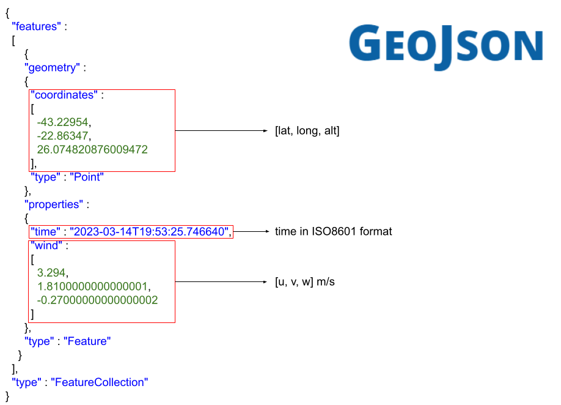

# wind2geojson



This package subscribes to a ```sensor_msgs/NavSatFix``` and ```geometry_msgs/Vector3Stamped``` topics, (with the GPS and
estimated wind velocity data) synchronizes them and stores the information in a .geojson file, thus providing georeferenced
wind velocity readings.

## Installation

Clone this repository to your preferred workspace with

```bash
cd ~/my_workspace/src
git clone https://gitlab.com/thalessilva1/wind2geojson.git
source ~/my_workspace/devel/setup.bash
catkin build wind2geojson
```

## Configuration

After cloning the package, refer to ```/config/config.yaml``` file for additional configurations and modify the parameters according to your specifications.

## Usage

Just launch the node with
```bash
source ~/my_workspace/devel/setup.bash
roslaunch wind2geojson wind2geojson.launch
```

Though, since this node needs flight data and wind velocity estiamtes, you probably should do
```bash
<include file="$(find wind2geojson)/launch/wind2geojson.launch"/>
```
to include this launch file to your general one.

To use it in another another package, refer to geojson_handler.hpp, add the header to your application, then
either instantiate an object or make your class inherit from GeojsonHandler. Use the constructor to set the output
filepath, and use the methods addPoint and writeToFile as expected.

## Contributing
Pull requests are welcome. For major changes, please open an issue first to discuss what you would like to change.
